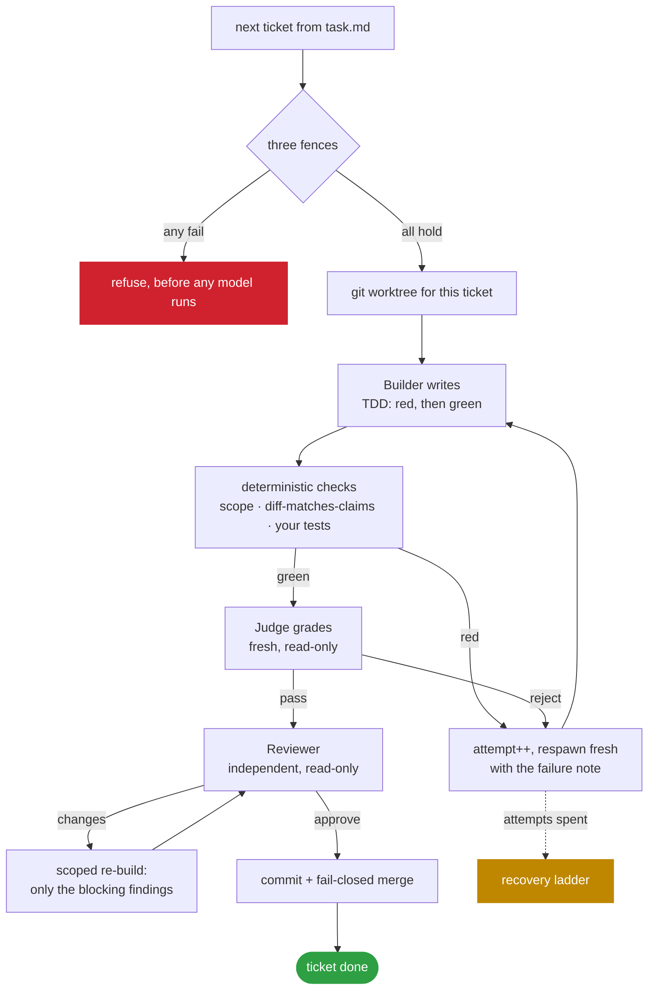
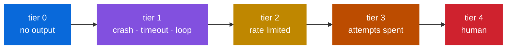
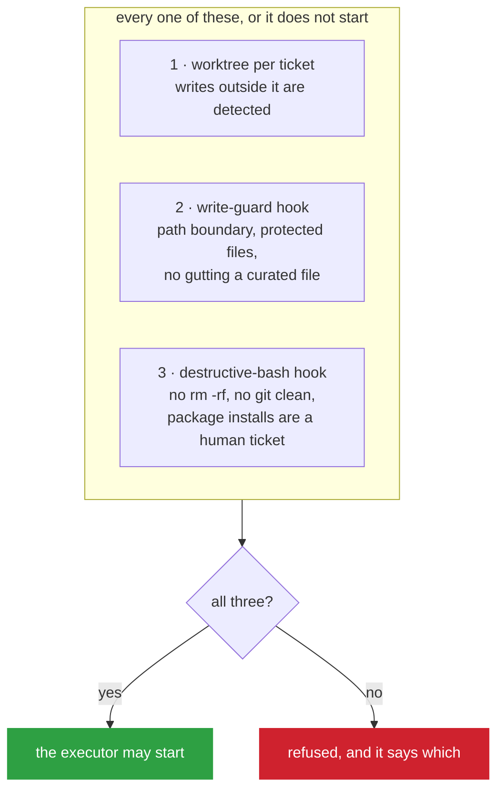

<div align="center">

# SCH-LOOP

### An autonomous software-development loop that builds, reviews and judges its own work

**You give it one sentence. It gives you back a specification, a plan, a queue of tickets, and working code that passed a review it did not write.**

[](#proof)
[](#why-zero-dependencies)
[](#requirements)
[](#the-engine)

</div>

---

## The one rule

> ### Code decides. Models advise.

Every verdict a model returns is **evidence** for a decision made in JavaScript. No model is ever asked whether its own work passed.

The Builder writes. The Judge grades. The Manager decides. They are three separate processes, and the one that produced the work can never approve it.

That single constraint is why this is a loop and not a chatbot with a `while` around it.

---

## What it actually does

You type one sentence:

```
A tiny command-line habit tracker. A person records that they did a habit today,
sees a streak count, and lists their habits with current streaks.
```

Nobody writes anything else. The loop produces:

| Stage | What came back |
|:--|:--|
| **Brainstorm** | 7,700 characters — outcome, users, workflows, locked decisions, flagged assumptions |
| **PRD** | 10,400 characters — user-observable requirements with stable IDs |
| **Architecture** | 15,700 characters — a real diagram, an end-to-end trace, five ADRs |
| **Plan** | 14,300 characters — four phases, vertical slices, per-slice verification and stop conditions |
| **Tickets** | 13 tickets, 0 rejected — tracer-first, dependencies correct, two decisions gated to a human |
| **Build** | RED → GREEN, reviewed, judged, merged |

**The plan caught two risks nobody mentioned to it.** That `node --test "tests/**/*.test.mjs"` may not expand its glob on the declared Node floor — reporting a green run that executed *zero tests*. And that a test could write to the developer's real data file.

That is what a specification stage is for.

---

## How it works

### The lifecycle


Each stage reads the one before it and is checked for **substance**, not existence. A PRD without requirement IDs is not a PRD. An architecture without a diagram is not an architecture. A rejected draft is kept so the next attempt starts from something.

Stage seats are **read-only**. They return the document; the engine writes the file. A stage able to write its own artifact could write anything else in your project.

### The per-ticket loop



Two gates here are worth naming:

- **`diff_matches_claims`** — the Builder's own "FILES CHANGED" list must equal what git says. A builder that does not know what it did is exactly when a judge must not trust its summary.
- **Scope containment** — writes outside the ticket's `allowed_paths` fail the attempt, and **untracked files count**. Creating a file is the most common way to escape a path boundary.

### When something goes wrong



| Tier | Trigger | What happens |
|:--|:--|:--|
| **0** | the process goes quiet | nudge — the window is clamped below the hard timeout so it can always fire |
| **1** | crash, timeout, or a loop of identical tool calls | `attempt++`, respawn **fresh**, carrying the failure note |
| **2** | rate limit or overload | back off 1 → 2 → 4 → 8 minutes, attempt unchanged |
| **3** | attempts exhausted | mark `[!]`, **convene the council**, re-dispatch **once** with its verdict |
| **4** | council skipped, failed, or a second red | mark `[?]`, notify, move to the next unblocked ticket |

**The council** is several different CLIs arguing: independent proposals, anonymised cross-critique, rebuttals, an adversarial challenge, then a chair that synthesises without majority vote. One seat being logged out costs that seat and nothing else — the debate continues on a quorum.

In a live run the council read the engine's own source and correctly predicted that its ticket would terminate at `[?]` two rounds later. It did.

---

## Safety: three fences

Bypass mode refuses to start unless **all three** hold. This is the part that lets an agent run unattended without you watching it.



The reviewer and judge are **tool-restricted read-only** on top of that. Asked directly to create a file, a live reviewer seat replied: *"CANNOT — write was denied by permission gate."*

---

## Install

### Requirements

- **Node ≥ 20**
- **git**
- At least one agent CLI on your `PATH`. The engine auto-detects `claude`, `codex`, `opencode`, `gemini` and `antigravity`, and seeds your roles from whatever it finds.

### Set up a project

```bash
git clone https://github.com/shekharcharles/SCH-LOOP.git
cd /path/to/your-project

SCH_PROJECT_ROOT="$PWD" node /path/to/SCH-LOOP/sdlc/engine/runtime/cli.mjs setup
```

That installs the engine, both fences, the skills and your config into the project, then **asserts the result can actually run** — engine present, both hooks on disk *and* wired into settings, roles complete, queue present. It exits non-zero if any of that is false, because an installer that reports success for a project that cannot execute anything is worse than one that fails.

Re-run it any time to refresh. It copies over the top and prunes afterwards, so your project is never left without an engine, not even for an instant. Your queue, tickets and reports are yours and are never touched.

### Choose who does what

```bash
node .claude/sch/runtime/cli.mjs dashboard
```

<div align="center">

**A local page, loopback only, that writes exactly one file.**

</div>

Pick the CLI, the model and the flags for every seat — executor, reviewer, judge, and each council chair. Nothing about a model or a flag is hard-coded anywhere in the engine; `roles.json` is the whole truth and this is an editor for it. It will refuse to save a reviewer or judge that is able to write, which is the same rule the dispatcher enforces at dispatch time.

### Build something

```bash
node .claude/sch/runtime/cli.mjs stage brainstorm --goal "what you want built"
node .claude/sch/runtime/cli.mjs stage next     # prd → architecture → plan
node .claude/sch/runtime/cli.mjs plan-to-tickets
node .claude/sch/runtime/cli.mjs run
```

---

## The queue

`task.md` is a plain markdown file, read top to bottom. It is the contract between you and the loop, and you can edit it in any text editor.

```markdown
## Phase 1 — Recording works end to end   (1/2 done)
- [x] T1.1-walking-skeleton  build  Walking skeleton: done <habit>  deps:-     size:L
- [ ] T1.2-same-day-repeat   build  Same-day repeat is a no-op      deps:T1.1  size:S

## Phase 2 — Reading back is correct   (0/3 done)
- [ ] T2.1-streak-reads-back build  streak <habit> reads back       deps:T1.2  size:M
- [ ] T3.1-confirm-adr-0005  decision  Confirm ADR-0005             deps:T2.3  size:XS  gate:blocking-human
```

| Glyph | Meaning |
|:-:|:--|
| `[ ]` | pending |
| `[~]` | in progress |
| `[x]` | done |
| `[!]` | blocked — the council may convene |
| `[?]` | needs a human, and will not be dispatched again |

**IDs are never renumbered.** New work found mid-run is inserted with a suffix — `T1.4a` slots between `T1.4` and `T2.1` — so a ticket ID printed in a report six weeks ago still means the same thing.

### Ticket types

`build` · `test` · `spike` · `research` · `docs` · `review` · `chore` · `human` · `decision`

`build` and `test` run TDD and independent review. `human` and `decision` **never spawn an executor** — they stop and wait for you. Size picks the timeout: XS 5 min, S 15, M 30, L 60.

---

## Verification you can trust

When a phase claims to be finished, the loop works **backwards from the goal**, not forwards from the tickets:

| Level | Question |
|:--|:--|
| **exists** | is the file there? |
| **substantive** | is it real, or a stub with a placeholder return? |
| **wired** | is it imported *and called*? |
| **flowing** | does real data reach it, or is a static fallback standing in? |

Code gathers the evidence — which tickets, which files were actually delivered, and what the checks returned. A read-only seat judges it, and it is **handed the exit codes it cannot overrule**. A phase whose tests are red cannot be verified by argument.

> **This caught something a passing review missed.** A reviewer approved a ticket against all four acceptance criteria with file-and-line evidence. Goal-backward verification then found that the filtered code path's copy guarantee rested on reading the code rather than on any test. It named the exact test to write. A follow-up ticket wrote it.
>
> Task completion is not goal achievement.

---

## The engine

33 modules, each with its tests beside it.

| Module | Owns |
|:--|:--|
| `taskmd` | the queue: parse, next, insert, set status |
| `tickets` | the ticket schema, validated before anything is written |
| `roles` | seats, flag presets, spawn argv — no model is hard-coded |
| `spawn` | one watched process: streamed events, silence, loop detection, timeout |
| `seats` | the single answer to "what can be asked a question" |
| `fences` | the three bypass fences, checked before any model runs |
| `worktrees` | a worktree per ticket, merge-base evidence, fail-closed delivery |
| `self-correct` | attempts, the failure note, the Manager decision |
| `review` | two-verdict review with adversarial verification of blocking findings |
| `watchdog` | the dispatch loop, heartbeat, rate-limit backoff |
| `escalate` | the council gate, the one re-dispatch, the human hand-off |
| `council` | proposal → critique → rebuttal → challenge → synthesis |
| `stages` | the front half, and the seam into the queue |
| `verify-phase` | goal-backward verification |
| `ship` | release gates and the pull request |
| `notify` | the durable notification log |
| `setup` | onboarding, and proving the result runs |
| `dashboard` | the Roles page |

### Why zero dependencies

Everything is Node's standard library. Nothing to audit, nothing to update, no supply chain. The tests need no network and no fixtures beyond temporary directories — but the fences, the worktrees and the ship gates all run **real git**.

---

## Proof

Measured on live runs, not estimated:

| | |
|:--|:--|
| Cost per ticket | **~$0.40** — build, judge and independent review |
| Peak context window during a ticket | **44k–52k** of 200k |
| Baseline for a fresh process | **43.7k** |
| A gated council, 3 seats | **~7 minutes**, 11 model calls |
| Engine tests | **161**, green across 8 consecutive runs |

Every claim in this README came from a run that was recorded. Where something is not proven, it says so below.

### What is not proven

- **One runtime.** Two projects, both Node with `npm test`. No build step, no dependencies to install, no compiled language. Every timeout and prompt is tuned against that shape.
- **A package install has never been needed.** The fence correctly makes one a `human` ticket; that path has not been walked end to end.
- **The council has convened once.** Its cost and failure modes rest on a single sample.

---

## Layout

```
sdlc/engine/     the engine — runtime, hooks, skills, tests
sdlc/lab/        the project the per-ticket loop was proven on
pentest/         security-engagement packs, deliberately kept apart
docs/            the design document, ADRs, and the archived v2 README
```

Pen-testing lives in its own folder on purpose. An engagement checks authorization before it touches anything, its scope gate is not a suggestion, and exploitation is a human gate no autonomous mode may skip. Folding those rules into a loop built to merge code unattended is how one set of gates ends up applied to the other's work.

---

## Commands

```
setup [--force]          install the engine into a project and prove it runs
dashboard [--port N]     the Roles page
goal [text]              read or set what this project is for
stage <id|next>          brainstorm · prd · architecture · plan
stages                   what is done, and what runs next
plan-to-tickets          PLAN.md becomes task.md and the ticket JSONs
run [--max N]            dispatch every ready ticket in queue order
ticket <id>              one ticket, all the way through
next | tasks             what runs next | every ticket parsed
insert <spec.json>       add a ticket mid-run, in the right place
verify-phase <n>         goal-backward verification
ship <n> [--dry-run]     release gates, then the pull request
notifications [--read]   what the loop told you
council <spec.json>      convene a debate by hand
roles | fences | config | heartbeat | doctor | seats
```

---

<div align="center">

**Built by [shekharcharles](https://github.com/shekharcharles)**

*Code decides. Models advise.*

</div>
