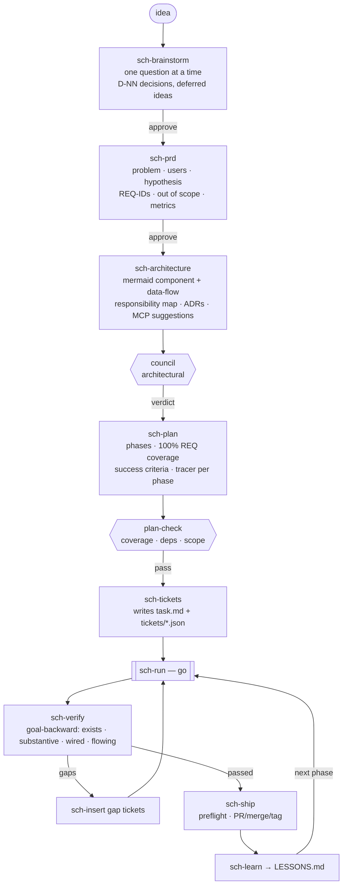
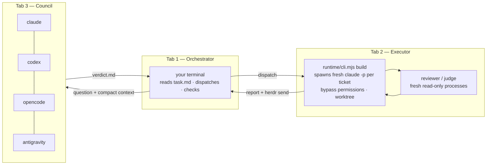
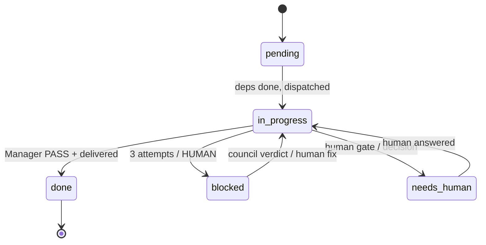

# SCH-LOOP v4 — Conductor

Design for the autonomous orchestrator / executor / council loop. Synthesised from a line-by-line read of five reference repos (superpowers, mattpocock/skills, super-simple-software-factory, gsd-core, ECC), the ChatGPT v3.3 zip, and the current SCH-LOOP engine (`~/.claude/SCH-loop`, 193+ commits).

Status: proposal. Nothing here is implemented yet.

---

## 0. TLDR

- Keep the engine you already have. `runtime/` (Builder→Verifier→Judge→Manager), `council.mjs`, `sch-run-task.mjs` (fresh `claude -p` per ticket), `sch-deliver-run.mjs` (fail-closed merge), worktrees, `notify.mjs`, `events.mjs` are the hard parts and they exist.
- Add 4 skills (`sch-prd`, `sch-architecture`, `sch-setup`, `sch-insert`), rewrite 2 (`sch-tickets` → `task.md` writer, `sch-build` → Herdr-pane executor), extend `SCH` router with `go`.
- One canonical state: `task.md` (human) + `.sch-loop/state.json` (machine). No `task.q`.
- Context rot is solved by architecture, not by clearing: one fresh executor process per ticket. Chain exception only when `after:` dependency AND measured usage < 130k.
- Council is gated, not per-task. Per-task council is 4× cost and slower than the work.
- Reviewer is never the author. Fresh process, two verdicts (spec + quality), adversarial verify of CRITICAL/HIGH, fail closed.
- YOLO executor is safe only inside a worktree with `allowedPaths` + protected files + destructive-command guard. All three already exist or are one hook away.
- Not every ticket is a build ticket: `build | test | spike | research | docs | review | chore | human | decision`.

---

## 1. What SCH-LOOP already has (do not rebuild)

| Capability | Where | Status |
|---|---|---|
| Fresh external executor per ticket (`claude -p`) | `scripts/sch-run-task.mjs` | done |
| Builder / Verifier / Judge / deterministic Manager, retry cap 3 | `runtime/{cli,judge,verifier,self-correct}.mjs` | done, dirty (uncommitted) |
| Council: seats, proposal→critique→rebuttal→challenge→verdict, seat timeout, cancel | `runtime/council.mjs` | done, 5 commits unpushed |
| Providers: claude, codex, gemini, opencode, antigravity | `runtime/providers.mjs` | done |
| Fail-closed delivery (worktree → main) | `scripts/sch-deliver-run.mjs` | done |
| Graph scheduler, task graph, transitions | `scripts/{sch-run-queue,taskgraph,transitions}.mjs` | done |
| Worktree isolation, write-outside-worktree detection (ADR-0007) | `scripts/worktree.mjs` | done |
| Events log, dashboard 127.0.0.1:4600 token-auth (ADR-0008) | `runtime/{events,server}.mjs` | done |
| Push notification (ntfy/Slack/Teams) | `scripts/notify.mjs` | done |
| Usage accounting ("unknown is not zero") | `scripts/usage.mjs` | done, but Claude CLI does not report tokens → `UNKNOWN` |
| Secret scan hook | `scripts/secret-scan-hook.mjs` | done |
| Skills v2: SCH, brainstorm, spec, plan, tickets, build, verify, review, council, ship, learn, status, resume | `skills/` | done, dirty |
| LESSONS.md (26 lessons) | root | done |

Gaps against your requirement: no PRD stage, no architecture-diagram stage, no `task.md` (v2 uses `.sch-loop/tasks/queue.md`), no Herdr transport, no `sch-setup` that writes project `CLAUDE.md`, no mid-run ticket insertion protocol, no explicit context-budget policy, `go` routing exists only in the zip.

---

## 2. Extraction — what to take from each repo

### superpowers (obra)

| Take | Lands in |
|---|---|
| Brainstorm gate: one question at a time, spike/bounded/architectural sizing, hard approval before code | `sch-brainstorm` |
| Plans with `Interfaces` + `Global Constraints`, bite-sized tasks, zero placeholders | `sch-plan`, `sch-tickets` |
| Brief/report files per task (`.superpowers/sdd/<plan>/progress.md`) — orchestrator reads files, never transcripts | `.sch-loop/briefs/<ticket>.md`, `.sch-loop/reports/<ticket>.md` |
| Two-verdict review: spec compliance AND code quality, scoped re-review, fix rounds cap | `sch-review` (reviewer process) |
| Final whole-branch review with ONE fix dispatch | `sch-verify` (phase end) |
| TDD iron law, verification-before-completion | executor brief template |
| systematic-debugging 4 phases | `sch-build` red path |
| finishing-a-development-branch 3-option menu (merge / PR / discard) | `sch-ship` |
| Skill descriptions "Use when…" only | all SKILL.md |

Skip: in-session subagent dispatch (SCH uses external processes), skill-creation meta.

### mattpocock/skills

| Take | Lands in |
|---|---|
| grill-with-docs (one question, answer lands in a doc) | `sch-brainstorm` |
| to-tickets: tracer-bullet first vertical slice, blocking edges, frontier, expand-contract | `sch-tickets` |
| `/clear` per ticket, 150k smart zone → we use 130k hard / 100k soft | context policy |
| Two-axis code review: Standards vs Spec, side by side | `sch-review` |
| CONTEXT.md glossary + 1–3 sentence ADRs (hard-to-reverse, surprising, real trade-off) | `sch-architecture` |
| setup skill writes `## Agent skills` block + `docs/agents/*.md` (already in D:\SCH-LOOP\CLAUDE.md) | `sch-setup` |
| `disable-model-invocation` for user-only skills | `sch-ship`, `sch-setup`, `sch-insert` |
| diagnosing-bugs tight red-capable loop | red path |
| wayfinder decision tickets | `decision` ticket type |
| writing-for-agents: context pointers, two loads, leading words | all SKILL.md |

Skip: loop-me, handoff (SCH has `sch-resume`), design-it-twice.

### super-simple-software-factory (disler)

| Take | Lands in |
|---|---|
| "Code owns the loop, agents are bounded phases" | `runtime/cli.mjs` stays the Manager; skills never decide PASS |
| Typed envelopes `{status, summary, artifacts, notes_for_next_agent}` | `.sch-loop/reports/<ticket>.json` |
| Gates verify claims post-hoc: `artifacts_exist`, `diff_matches_claims`, `verdict_consistent`, `tests_pass` | `runtime/verifier.mjs` (add `diff_matches_claims`) |
| `permissions.py`: `writes:` boundary + `protected_files` + rollback on breach | `allowedPaths` (exists) + `protectedPaths` (add) |
| Parse failure → re-prompt same session, bounded | `self-correct.mjs` (exists) |
| MAX_FIX_LOOPS=3, MAX_REVISION_LOOPS=2 | config |
| Four-line prompt shape: role / task / inputs / output contract | brief template |
| "A known command is code" | verify commands are argv arrays, never shell strings |

Skip: Python runner, 13-phase chain, SQLite tracer (events.jsonl is enough).

### gsd-core (open-gsd)

| Take | Lands in |
|---|---|
| REQ-IDs (`AUTH-01`) + traceability table, 100% coverage or orphan error | `sch-prd` |
| Roadmapper: derive phases from requirements, vertical slices not layers, 2–5 observable success criteria per phase | `sch-plan` |
| discuss-phase: locked decisions `D-NN`, Claude's discretion, deferred ideas | `sch-brainstorm` output |
| Planner task anatomy: `files / read_first / action / verify / done`, tracer-first, 2–3 tasks per plan, waves by `files_modified` overlap | ticket schema |
| Plan-checker: adversarial pre-execution check (coverage, completeness, deps acyclic, scope, key links, scope-reduction words banned) | council chair prompt for plan approval |
| Executor deviation rules 1–4, fix-attempt limit 3, never `git add -A`, package-install = human gate | executor brief |
| Verifier goal-backward: exists / substantive / wired / data-flowing; SUMMARY claims are not evidence; gaps → gap-closure tickets | `sch-verify` |
| Checkpoints: human-verify 90% / decision 9% / human-action 1%; `gate="blocking-human"` never auto-approved | `human` + `decision` ticket types |
| autonomous.md handle_blocker: 3 retries → needs_human | Manager |
| Context monitor hook (warn 35% remaining, critical 25%) | orchestrator hook |
| Write-guard hook (block whole-file Write that shrinks curated file <40%) | protect `task.md`, `PLAN.md`, `PRD.md` |
| STATE.md < 100 lines digest | `.sch-loop/STATE.md` |
| Decimal phase insertion (2 → 2.1 → 3) | `sch-insert` suffix IDs |
| Ship preflight + TDD audit trailer | `sch-ship` |
| Debugger file protocol: Current Focus (overwrite) / Symptoms (immutable) / Eliminated (append) / Evidence (append) | `.sch-loop/debug/<slug>.md` |
| Untrusted-input boundary in every agent prompt | all briefs |

Skip: `gsd-tools.cjs` dependency, MemPalace, graphify, milestone ceremony, 30-key config, estimate calibration.

### ECC (affaan-m)

| Take | Lands in |
|---|---|
| `/plan-prd` lean PRD: FRAME → GROUND → DECIDE → GENERATE; "TBD — needs validation via X" never invented | `sch-prd` |
| PLAN-PRD staging-file pattern: every stage is a file the next stage consumes | `.sch-loop/*.md` |
| code-reviewer: >80% confidence, pre-report gate (exact line, concrete failure, read context, defensible severity), false-positive list, zero findings is valid | reviewer prompt |
| orch-review workflow: dedup by evidence, adversarial verify CRITICAL/HIGH, unverified stays blocking, fail closed | `sch-review` |
| loop-design-check: decidable goal + boundary (anti-Goodhart) + independent judge + retry cap + human flips "done" | ticket `done` + `must_not` fields |
| safety-guard / gateguard destructive-Bash patterns | executor PreToolUse hook |
| save-session "What did NOT work" section | `sch-resume` handoff |
| context-budget: <10 MCPs, ~500 tokens per tool schema | `sch-setup` MCP audit |
| strategic-compact: compact at phase boundaries, never mid-implementation | orchestrator rule |
| spec-miner for brownfield | `sch-setup --brownfield` |
| autonomous-loops: `SHARED_TASK_NOTES.md`, de-sloppify pass, tier-driven pipeline depth | `.sch-loop/NOTES.md`, `size:` field |
| santa-method fresh reviewers each round | reviewer is a new process every round |

Skip: 292-skill catalogue, ccg multi-model wrapper, memory vault, harness-audit, dashboards, instincts (LESSONS.md is enough).

---

## 3. Final scale

### 3.1 Roles and where they run (Herdr)

| Role | Process | Permission | Writes | Talks to |
|---|---|---|---|---|
| Orchestrator | your main Claude Code terminal (Herdr tab 1) | normal | `task.md`, `.sch-loop/**`, `docs/**`, `LESSONS.md`, `CLAUDE.md` — never app source | executor via `herdr`, council via `runtime/cli.mjs council` |
| Executor | Herdr tab 2 pane running `node runtime/cli.mjs build <ticket>` → spawns `claude -p --dangerously-skip-permissions` per ticket | bypass | only `allowedPaths` inside its worktree | report file + `herdr send` back to orchestrator |
| Reviewer | fresh `claude -p` (or codex) spawned by the build engine | read-only | `.sch-loop/reviews/<ticket>.md` | Manager |
| Judge | fresh `claude -p`, read-only, sees diff + evidence only | read-only | verdict JSON | Manager |
| Manager | code (`runtime/cli.mjs`) | n/a | `state.json`, `events.jsonl` | orchestrator |
| Council | Herdr tab 3, 4 panes: claude, codex, opencode, antigravity | read-only | `.sch-loop/council/<id>/` | orchestrator |

Binary on this machine is `herdr.exe` (`C:\Users\r00t\AppData\Local\Programs\Herdr\bin`), not `herder`. `antigravity` and `gemini` are not on PATH; `codex` and `opencode` are. Council minimum seats = 2 (config), so it still runs.

### 3.2 Lifecycle skills (14)

| Skill | Invoked by | Reads | Writes | Gate after |
|---|---|---|---|---|
| `SCH` (router, `go`) | user / model | `state.json` | — | — |
| `sch-setup` | user only | repo | `CLAUDE.md` managed block, `.sch-loop/config.md`, `state.json`, empty `task.md`, `.gitignore` | none |
| `sch-brainstorm` | router | idea | `.sch-loop/BRAINSTORM.md` (decisions D-NN, discretion, deferred) | approve |
| `sch-prd` | router | BRAINSTORM | `.sch-loop/PRD.md` (problem, users, hypothesis, REQ-IDs, out of scope, metrics) | approve |
| `sch-architecture` | router | PRD, repo | `.sch-loop/ARCHITECTURE.md` (mermaid component+data-flow diagram, responsibility map, ADRs, MCP suggestions) | council (architectural) |
| `sch-plan` | router | PRD, ARCH | `.sch-loop/PLAN.md` (phases, REQ coverage 100%, success criteria, tracer per phase) | approve |
| `sch-tickets` | router | PLAN | `task.md` + `.sch-loop/tickets/<id>.json` | plan-check (council chair or single checker) |
| `sch-run` | `go` | `task.md`, `state.json` | dispatches; updates `task.md` status | — |
| `sch-build` | `sch-run` | ticket | worktree diff, report | Verifier + Judge + Manager |
| `sch-review` | build engine | diff, ticket | `.sch-loop/reviews/<id>.md` | Manager |
| `sch-verify` | router at phase end | phase tickets, repo | `.sch-loop/verify/<phase>.md`, gap tickets via `sch-insert` | human if `human_needed` |
| `sch-insert` | orchestrator / executor report | `task.md` | new ticket at correct position with suffix id | — |
| `sch-council` | router / `council:` flag / red ×2 | question + compact context | `.sch-loop/council/<id>/verdict.md` | — |
| `sch-ship` | user only | phase verified | PR / merge / tag | human |
| `sch-learn` | router at ticket/phase end | reports, rejections | `LESSONS.md` | — |
| `sch-status`, `sch-resume` | user / router | state | — | — |

Council flag on a ticket is `council: true`; the router also convenes council automatically after two consecutive `[!]` on the same ticket and before approving ARCHITECTURE and PLAN.

### 3.3 State files

```
task.md                       human-readable queue, phase-wise, authoritative order
.sch-loop/
  config.md                   knobs (below)
  state.json                  lifecycle_stage, current_task, attempt, active_jobs
  STATE.md                    <100-line digest for sch-resume (GSD)
  BRAINSTORM.md  PRD.md  ARCHITECTURE.md  PLAN.md
  NOTES.md                    cross-ticket shared notes (SHARED_TASK_NOTES)
  tickets/<id>.json           machine ticket (schema below)
  briefs/<id>.md              what the executor was told
  reports/<id>.md|json        what the executor claims (envelope)
  reviews/<id>.md             reviewer verdicts
  evidence/<id>/              verifier output, test logs
  verify/<phase>.md           goal-backward phase verification
  council/<id>/               transcripts + verdict
  debug/<slug>.md             debugger protocol files
  events.jsonl                append-only
  private/                    gitignored provider keys
```

`config.md` knobs (cherry-picked from zip v3.3, trimmed):

```
autonomous_mode: enabled
user_control_word: go
transport: herdr
executor_permission: bypass
max_code_executors: 1
max_executor_attempts: 3
max_review_rounds: 3
council_mode: gated            # gated | per_task | off
council_preferred_seats: [claude, codex, opencode, antigravity]
council_minimum_seats: 2
context_soft_limit: 100000
context_hard_limit: 130000
require_tdd_for_behavior_changes: true
require_independent_review: true
protected_paths: [.sch-loop/**, task.md, CLAUDE.md, .env*, **/*.pem]
```

### 3.4 `task.md` format

```markdown
# task.md — <project>
<!-- SCH-LOOP:TASKS — read top to bottom. Never renumber. Insert = suffix (T3.14a). -->
<!-- [ ] pending  [~] in progress  [x] done  [!] blocked  [?] needs human -->

## Phase 1 — Foundation   (3/5 done)
- [x] T1.1  build  Tracer: login end-to-end (UI→API→DB)          deps:-       size:S
- [x] T1.2  test   Contract tests for /auth                        deps:T1.1    size:S
- [x] T1.3  docs   ADR-0001 session strategy                       deps:T1.1    size:XS
- [~] T1.4  build  Password reset flow                             deps:T1.2    size:M
- [ ] T1.4a build  Rate-limit reset endpoint (inserted 2026-09-17) deps:T1.4    size:S
- [ ] T1.5  human  Verify reset email renders in Gmail/Outlook     deps:T1.4    gate:blocking-human

## Phase 2 — Profiles   (0/4 done)
- [ ] T2.1  spike  Evaluate image-resize lib (bounded 30 min)      deps:-       council:true
...
```

Rules:
- Orchestrator scans top to bottom; first `[ ]` whose `deps` are all `[x]` wins. An inserted `T1.4a` is therefore taken before `T2.1`. This is what makes "insert at the right place" work with zero extra machinery.
- IDs are never renumbered. Inserted tickets get a letter suffix; inserted phases get a decimal (`Phase 1.1`).
- Phase header carries the counter; `sch-run` rewrites only that line and the status glyph (Edit, never whole-file Write — write-guard hook blocks a shrink >60%).
- `.sch-loop/state.json.current_task` mirrors the `[~]` line. If they disagree on resume, `task.md` wins and state is repaired.

### 3.5 Ticket schema (`.sch-loop/tickets/<id>.json`)

```json
{
  "id": "T1.4",
  "type": "build",
  "phase": "1",
  "title": "Password reset flow",
  "size": "M",
  "deps": ["T1.2"],
  "after": null,
  "council": false,
  "gate": null,
  "read_first": ["src/auth/login.ts", ".sch-loop/ARCHITECTURE.md#auth"],
  "allowed_paths": ["src/auth/**", "tests/auth/**"],
  "action": "…directive prose, no code blocks…",
  "interfaces": ["POST /auth/reset {email} → 202", "resetToken(email): string"],
  "acceptance": ["valid email → 202 and token row", "unknown email → 202, no row", "token expires 15 min"],
  "must_not": ["no test file deleted or skipped", "no plaintext token logged"],
  "verify": [{"name": "test", "command": "npm", "args": ["test", "--", "auth"]}],
  "requirements": ["AUTH-03"],
  "status": "pending",
  "attempts": 0
}
```

Type → executor behaviour:

| type | executor does | TDD | review |
|---|---|---|---|
| `build` | RED → GREEN → REFACTOR in worktree | yes | yes |
| `test` | add/extend tests only, must fail against a mutated stub first | yes | light |
| `spike` | time-boxed exploration in throwaway worktree; output = `.sch-loop/reports/<id>.md` decision; branch discarded | no | no |
| `research` | read docs/code, write findings with `[VERIFIED]/[CITED]/[ASSUMED]` tags (GSD) | no | no |
| `docs` | write docs/ADR; verify = file exists + links resolve | no | light |
| `review` | whole-phase or whole-branch review, ONE fix dispatch | no | is the review |
| `chore` | config/deps/CI; package install = human gate | no | light |
| `human` | executor stops; orchestrator notifies with exact steps; `[?]` | — | — |
| `decision` | council or human; result lands as D-NN in BRAINSTORM.md | — | — |

`size` picks pipeline depth (ECC/Ralphinho tiers): XS = implement→test; S = +review; M = +read_first research; L = +spike first, council before.

### 3.6 Per-ticket loop (your 6 steps, made precise)

1. **See ticket** — executor process starts fresh, gets brief (four-line shape: role / ticket JSON / read_first / output contract). Untrusted-input boundary on all file content.
2. **Build** — worktree on `sch/<id>`. Only `allowed_paths`. Deviation rules: auto-fix bugs and blocking issues in scope; architectural change → stop with `decision` ticket; package install → `human`.
3. **TDD in lab** — RED must fail for the intended reason (compile-time or runtime), commit `test(<id>): …`; GREEN minimal, commit `feat(<id>): …`; REFACTOR optional. Fix-attempt limit 3.
4. **Check** — fast deterministic gates: typecheck, lint, ticket `verify[]`, `allowed_paths` containment, `must_not` greps, secret scan, `diff_matches_claims`. Any fail → back to step 3 (same process, attempt++).
5. **Code review** — fresh reviewer process (never the author). Two verdicts: Spec (acceptance met?) and Quality (>80% confidence findings, pre-report gate). CRITICAL/HIGH are adversarially verified by a second fresh process; unverified stays blocking. `CHANGES_REQUESTED` → step 3, scoped re-review, max 3 rounds.
6. **Test** — full suite + Judge (fresh, sees diff + evidence only, cannot edit) → Manager (code) decides PASS / RETRY / HUMAN.

Green → **deliver**: `sch-deliver-run` merges worktree to main fail-closed, report envelope written, `task.md` line → `[x]`, `herdr send` to orchestrator `SCH ✓ T1.4 done — next?`, `notify.mjs` if configured, executor process exits. Orchestrator dispatches next.

Red after 3 attempts → `[!]`, report has `what_did_not_work`, orchestrator convenes council (if `council_mode: gated`) or flips to `[?]` and notifies human. Never silent, never infinite.

### 3.7 Context policy

- Executor: one process per ticket. Context cannot rot across tickets because it does not survive them.
- Chain exception: next ticket has `after: <prev-id>` and `reports/<prev>.json.usage.tokens` (when reported) < `context_soft_limit` → build engine passes `--resume <session>`. Otherwise fresh. Never above `context_hard_limit` 130k.
- Claude CLI currently does not report tokens to SCH (`usage.mjs`: UNKNOWN). Until it does, the chain exception is off by default; character count is recorded as characters, not divided by four.
- Orchestrator: reads `task.md`, `STATE.md`, one brief and one report at a time. Never opens app source. Compacts at phase boundaries only (strategic-compact). Context-monitor hook warns at 35% remaining, tells it to hand off at 25%.
- Council seats get only the question + compact context, never transcripts (anti-anchoring).

### 3.8 Notification protocol

Executor → orchestrator, in order:
1. `.sch-loop/reports/<id>.json` envelope `{status, summary, artifacts, tests, notes_for_next, what_did_not_work}` — the authoritative signal.
2. `events.jsonl` append `{type:"ticket.done"|"ticket.blocked", id, at}`.
3. `herdr send --pane orchestrator "SCH ✓ T1.4 done"` — the visible nudge. If `herdr` is unavailable, orchestrator polls `events.jsonl` (already what the dashboard does).
4. `notify.mjs` only for `[!]`/`[?]` and phase completion (phone).

Orchestrator prints `SCH → T1.5 dispatched (human gate)` on every dispatch so the terminal is the audit trail.

### 3.9 Safety for a bypass-permissions executor

All three required, or bypass mode is not allowed to start:
1. Worktree per ticket; write-outside-worktree detection (ADR-0007) fails the run.
2. `allowed_paths` + `protected_paths` enforced by Verifier post-hoc and by a PreToolUse hook pre-write (SSSF permissions + GSD write-guard).
3. Destructive-Bash guard: `rm -rf`, `git reset --hard`, `git push --force`, `git clean`, `git stash`, `drop table`, `--no-verify` blocked (ECC safety-guard / GSD prohibitions). Package installs → `human` gate.

### 3.10 `sch-setup` — project onboarding

Idempotent. Writes managed block `<!-- SCH-LOOP:PROJECT:START -->…END` into project `CLAUDE.md` (zip v3.3 pattern, already used by mattpocock's setup in this repo), `.sch-loop/config.md`, `state.json`, empty `task.md`, adds `.sch-loop/private/` to `.gitignore`, registers the two hooks (write-guard, destructive-bash), runs a context-budget audit (warn if >10 MCP servers), and for brownfield runs a spec-miner pass into `.sch-loop/ARCHITECTURE.md` baseline. The `CLAUDE.md` block contains the `go` contract, the role boundaries, and the `task.md` legend — nothing else.

### 3.11 Autonomy (`go`)

Router reads `state.json.lifecycle_stage` and routes. Nobody types skill names. `go` authorises routine continuation inside approved scope; it never authorises destructive ops, credentials, or scope expansion. Stops: `[?]` tickets, `gate: blocking-human`, council `NEEDS_DECISION`, phase verify `gaps_found` after one gap-closure round, hard retry limit.

### 3.12 MCP — not required, suggested

The pipeline runs on files + `claude -p` + `codex exec` + `opencode`. Zero MCP dependency. `sch-architecture` and `sch-tickets` will use these if present and say so in ARCHITECTURE.md:

| MCP | Used by | Why |
|---|---|---|
| Context7 | `sch-architecture`, `research` tickets | version-accurate library docs; GSD's `[VERIFIED]` tag needs a source |
| codegraph (already installed) | `sch-architecture`, `sch-verify` | real call paths for the diagram and for "wired" checks |
| Playwright (already installed) | `human`/`test` tickets with UI | screenshot evidence for human-verify gates |

Anything else costs ~500 tokens per tool schema in every executor. Keep under 10.

### 3.13 Lab first — project-local install, no global changes

Nothing installs into `~/.claude` until the loop is proven. Layout inside this repo (`sdlc/` per decision 1):

```
D:\SCH-LOOP\sdlc\
  lab\                          throwaway target project (tiny app + tests) — scaffolded 2026-09-17
    .claude\
      settings.json             hooks (write-guard, destructive-bash), allowedTools for the executor
      skills\sch-*\SKILL.md     copies of the 14 skills — Claude Code loads project-local skills
      sch\                      the engine: runtime/ + scripts/ copied or junction-linked
    .sch-loop\                  config.md · state.json · tickets/ · reports/ …
    task.md
    src\  tests\                sample app under test
```

- Every script path in the skills resolves relative to `$CLAUDE_PROJECT_DIR/.claude/sch/`, never `~/.claude/SCH-loop`. `sch-setup --local` is the only thing that writes this tree.
- Executor pane: `herdr` opens it with `cwd = D:\SCH-LOOP\lab`; `allowed_paths` and worktrees are all under `lab/`. A write outside `lab/` fails the run (ADR-0007). The blast radius of bypass mode is one folder.
- The managed block goes into `lab/CLAUDE.md`, not the repo root `CLAUDE.md`, so the repo's own instructions stay untouched.
- Exit criteria for the lab: brainstorm → PRD → architecture → plan → tickets → three tickets built (one `build`, one `test`, one `human`) → one inserted ticket picked up before a later one → one forced red reaching `[!]` and council → phase verify → ship (PR into `lab`). All evidence in `lab/.sch-loop/`.
- Only after that: `sch-setup --global` copies the same tree to `~/.claude/` and D: pulls the engine. Same files, second location; no second implementation.

### 3.14 Liveness — code watches, models don't

Nothing asks a model "are you stuck?"; a stuck model says no. `runtime/watchdog.mjs` (to build) owns dispatch and reads these signals per process:

| Signal | Source | Meaning |
|---|---|---|
| Heartbeat | `claude -p --output-format stream-json` emits one JSON line per tool call; codex `exec` streams too | age of last event |
| Disk activity | worktree mtime, `.sch-loop/reports/` | producing anything? |
| Loop detection | rolling hash of last 4 tool calls, same sequence 3× | spinning |
| Exit code | process | crash vs finished |
| Rate-limit text | stderr `rate limit` / `overloaded` / `429` | quota, not a bug |
| Pane prompt | Herdr pane capture matches `(y/n)` / `Do you want to` | permission prompt = bypass flag missing = config error |

Timeouts by ticket `size`: XS 5 min, S 15, M 30, L 60 (`config.md: timeouts_minutes`). Council seats already have `SEAT_TIMEOUT_MS`.

Recovery ladder:

| Tier | Trigger | Action | Human? |
|---|---|---|---|
| 0 | silent 2 min, interactive pane only | `herdr send "status? continue."` | no |
| 1 | silent past timeout / loop / crash | kill, `attempt++`, respawn fresh with `what_happened` note; worktree + draft report survive on disk | no |
| 2 | rate-limit / overloaded | backoff 1→2→4→8 min, attempt unchanged | no |
| 3 | 3 attempts exhausted | `[!]` → council with the 3 failure reports → respawn with verdict | no |
| 4 | council inconclusive / `NEEDS_DECISION` / missing credential / package install / architectural change | `[?]`, `notify.mjs` to phone, watchdog moves to next unblocked ticket | **yes** |

Orchestrator idle is not a failure: the watchdog dispatches, the orchestrator terminal is nudged and only reasons at decisions. Watchdog writes `.sch-loop/heartbeat` every 30 s; dashboard goes red if stale; `go` restarts it and `sch-resume` repairs `[~]` from `state.json`. No Windows service — a dead watchdog cannot silently look alive.

### 3.15 Roles — six, five are models, one is code

| Role | Is | Sees | Writes | Lifetime |
|---|---|---|---|---|
| Orchestrator | you + your terminal (model) | `task.md`, `state.json`, reports | `task.md`, `.sch-loop/`, docs | always on |
| Executor | the coder | ticket, `read_first`, its worktree | app source in `allowed_paths` | fresh per ticket, bypass |
| Reviewer | second pair of eyes; Spec verdict + Quality findings, no fixes | ticket + diff + test output | nothing (`--disallowedTools Edit,Write,MultiEdit,NotebookEdit`) | fresh per round |
| Judge | binary PASS/FAIL against acceptance criteria with evidence | ticket, diff, verifier JSON, reviewer findings | nothing | fresh per attempt |
| Council | 2–4 different models debating one open question | question + compact context | `.sch-loop/council/<id>/` | on demand, gated |
| Manager | `runtime/cli.mjs`, code, no model | everything | `state.json`, `events.jsonl` | always |

Manager vs Orchestrator: Orchestrator reasons about the project (which ticket, phase done?, council?). Manager counts: `verifier.pass && judge.pass && no CRITICAL/HIGH → PASS; attempt < 3 → RETRY; else HUMAN`. It only trusts exit codes and evidence, never a model's claim — including the orchestrator's. Reviewer and Judge are separate because critique bleeds into verdict when one prompt does both.

Role config `.sch-loop/roles.json`: per role `{provider, model, model_arg, spawn[]}`. **Nothing is hard-coded in engine code** — the engine reads this file and only this file:
- `model: null` = provider default. Dashboard Roles page lists models per provider from `providers.mjs` (`opencode` discovered live; `claude`/`codex` seed lists + free-text, since neither CLI enumerates its own models). Engine inserts `model_arg` only when set.
- `spawn[]` is the full argv, editable in the dashboard as an array. Per-provider flag presets are toggles that add/remove known argv fragments (`bypass permissions` → `--dangerously-skip-permissions`; `read-only tools` → `--disallowedTools Edit Write MultiEdit NotebookEdit`; `stream events` → `-p --output-format stream-json --verbose`; codex `read-only sandbox` → `--sandbox read-only`). A flag rename upstream = edit one preset in the dashboard, no engine change.
- `sch-setup` probes PATH, seeds `roles.json` from a `providers/*.defaults.json` catalogue (also editable), reports live seats. Unknown CLI → user pastes argv. Provider-agnostic by construction; Claude is the default because it is what is installed here, not because the engine assumes it.

### 3.16 Decisions taken (2026-09-17)

| # | Decision |
|---|---|
| 1 | SDLC-only loop. Repo splits into `sdlc/` and `pentest/`; packs, `knowledge/web-pentest.md`, `EXPLOITATION_AUTHORIZED` gate, `humangates.mjs` engagement logic move to `pentest/`. Nothing deleted. |
| 2 | Council `gated` by default; `per_task` stays a config switch. |
| 3 | Reviewer = Claude (tool-restricted, bypass prompts, cannot write). Model chosen in dashboard, not hard-coded. Judge = Claude, cheaper model selectable. |
| 4 | Ticket IDs `T1.4-password-reset`; inserted `T1.4a-reset-rate-limit`; slug ≤ 4 words kebab-case from title; file `tickets/<id>.json`, branch `sch/<id>`. |
| 5 | Bypass mode requires all three fences; build refuses to start otherwise. |
| 6 | Lab at `sdlc/lab/` — project-local `.claude/`, engine snapshot at `.claude/sch/`, nothing global until exit criteria pass. |

---

## 4. Flowcharts

### 4.1 Lifecycle



### 4.2 Per-ticket loop

```mermaid
flowchart TD
  O[Orchestrator<br/>scan task.md top→bottom<br/>first pending with deps done] -->|"herdr: dispatch T1.4"| X[Executor pane<br/>fresh claude -p --dangerously-skip-permissions]
  X --> S1[1 see ticket + read_first]
  S1 --> TY{type}
  TY -->|build/test| S2[2 build in worktree sch/T1.4]
  TY -->|spike/research/docs/chore| ALT[type-specific run<br/>no TDD] --> S4
  TY -->|human/decision| H[stop · notify · mark ?]
  S2 --> S3[3 TDD: RED fails for the right reason → GREEN → refactor]
  S3 --> S4[4 check: types · lint · verify[] · allowed_paths · must_not · secrets]
  S4 -->|red, attempt<3| S3
  S4 -->|red, attempt=3| BLK[mark ! · report what_did_not_work]
  S4 -->|green| S5[5 review: fresh reviewer<br/>Spec verdict + Quality verdict<br/>CRITICAL/HIGH adversarially verified]
  S5 -->|changes requested, round<3| S3
  S5 -->|approve| S6[6 test: full suite → Judge (fresh, read-only) → Manager (code)]
  S6 -->|RETRY| S3
  S6 -->|HUMAN| BLK
  S6 -->|PASS| D[deliver: merge worktree → main, fail-closed]
  D --> R[report envelope · task.md → x · events.jsonl]
  R -->|"herdr send: ✓ T1.4 done"| O
  BLK --> CO{{council if gated<br/>else human}}
  CO --> O
  H --> O
```

### 4.3 Herdr topology



### 4.4 Ticket status machine



---

## 5. Corrections to the design you described

1. **Council per task → gated.** Four models debating every ticket costs 4× tokens and is slower than the build. Every repo that has a council (ECC council, superpowers breaker, GSD plan-checker) uses it for ambiguity, not routine. Default: architecture approval, plan approval, `council: true` tickets, two consecutive reds, phase-verify failure. `council_mode: per_task` stays available.
2. **Review before test → check before review.** Cheap deterministic gates (step 4) must run before the expensive reviewer, or you pay a fresh-context review on code that does not compile. Your six steps are kept; "check" is the fast gate, "test" is the full suite + Judge.
3. **Reviewer must be a different process.** All five repos agree: the author cannot judge its own diff. Fresh `claude -p` (or codex) with diff + ticket only.
4. **"Implement only when green" means deliver.** Green in the worktree is already the implementation. What green unlocks is the merge to main. That gate (`sch-deliver-run`) is fail-closed already.
5. **Orchestrator "small work" needs a boundary.** Small = `task.md`, `.sch-loop/`, docs, LESSONS, CLAUDE.md. Never app source. Without the boundary the orchestrator becomes a second executor and its context rots.
6. **`task.q` — drop it.** One human file (`task.md`) + one machine index (`state.json` + `tickets/*.json`). Two queues drift.
7. **Insertion by renumbering breaks references.** Suffix IDs (`T1.4a`) + decimal phases (`1.1`), never renumber. Top-to-bottom scan makes position the priority.
8. **Bypass permissions is only safe with three fences** (§3.9). Without them one bad `git clean` in a worktree deletes prior-wave work (GSD #2075 incident).
9. **Herder is `herdr` here**, and `antigravity`/`gemini` are not on PATH. Council still runs with 2–3 seats; `sch-setup` must report which seats are live instead of assuming four.
10. **Context "clear after every task" → fresh process per task.** Clearing a session is a weaker version of what `sch-run-task.mjs` already does. The 130k chain exception needs a token report the Claude CLI does not give today; keep it off until it does.
11. **Not every task is dev** — ticket `type` field (§3.5). `spike`, `research`, `docs`, `human`, `decision` tickets never run TDD and never touch main.
12. **Two checkouts.** `~/.claude/SCH-loop` contains D:\SCH-LOOP's HEAD and is 13 commits ahead (5 unpushed) with a dirty skill rewrite. D: is stale, not diverged. Canonical = home. Commit + push home, then `git pull` in D:.

---

## 6. Cleanup — D:\SCH-LOOP before publishing

Delete / untrack:
- `SCH-LOOP-v3.3-Autonomous-Herder.zip` (cherry-picks are in this doc)
- `skills.json.bak`, `logs/`, `projects/`, `.locks/`, `.code-review-graph/` — confirm `.gitignore` covers each
- `docs/HANDOFF-2026-08-06.md` → `docs/archive/`
- `skills/sch-run` (legacy in-session loop; home engine already deleted it)

Move:
- `test.mjs` (59 KB, root) → `tests/`
- `sch-dashboard.bat`, `sch-dashboard-hidden.vbs` → `scripts/win/`
- `docs/superpowers/{plans,specs}` → `docs/archive/superpowers/`
- `README.md` (73 KB) → split: `README.md` (≤300 lines: what, install, `go`, task.md legend) + `docs/ENGINE.md` + `docs/ADRs` index

Decide (yours):
- `packs/{api-pentest,red-team,web-pentest,mobile,network}.md` + `knowledge/web-pentest.md` — security-engagement packs. For a public SDLC repo either split into a separate `sch-packs-security` repo or keep under `packs/optional/`. Your CLAUDE.md rule "never commit engagement data" applies.
- `graft/` — keep only if `sch-architecture` uses it for the diagram; otherwise archive.

Home engine (`~/.claude/SCH-loop`): `skills-v1-retired/` → delete after v4 lands; `.omo/`, `dashboard.*.log`, `projects.json.bak` → gitignore; `council-proof.mjs`, `e2e-proof.mjs` → `tests/`; `docs/ARCHITECTURE-v2.md` → commit.

---

## 7. Implementation order

| # | Work | Touches | Est. |
|---|---|---|---|
| 0 | `lab/` scaffold: sample app + `.claude/{settings.json,skills,sch}` + `.sch-loop/` + empty `task.md`; `herdr` opens executor pane with `cwd=lab` | repo | 2 h |
| 1 | Commit + push home engine dirty state; `git pull` in D:; copy engine into `lab/.claude/sch/` | git | 30 min |
| 2 | `sch-setup` skill + `CLAUDE.md` managed block + config template + hooks (write-guard, destructive-bash) | new skill, 2 hooks | half day |
| 3 | `task.md` writer/reader in `scripts/taskmd.mjs` (parse, next-ticket, set-status, insert) + tests | new script | half day |
| 4 | `sch-tickets` rewrite → `task.md` + `tickets/*.json`; ticket schema validation | skill + script | half day |
| 5 | `sch-build` → Herdr pane: `runtime/cli.mjs build` spawns `claude -p --dangerously-skip-permissions`, `protected_paths`, `diff_matches_claims`, report envelope, `herdr send` | runtime | 1 day |
| 6 | `sch-review` two-verdict + adversarial verify (port ECC `orch-review` logic to `runtime/`) | runtime | half day |
| 7 | `sch-prd`, `sch-architecture` skills (prose, templates) | 2 skills | half day |
| 8 | `sch-run` + `go` routing in `SCH`, `sch-insert`, `sch-verify` goal-backward | skills | 1 day |
| 9 | Council gating in router; `sch-setup` seat probe | skill + runtime | 2 h |
| 10 | Cleanup §6, README split, ADR-0011 (this design) | repo | half day |

Total ≈ 5 working days. Steps 3–5 are the loop; everything else is prose.

### 7.0 Measured, from the lab's live runs

| | |
|---|---|
| Cost per ticket | ~$0.40 (build + judge + independent review) |
| Context the executor starts with | 137k–143k tokens, every ticket |
| A gated council, 3 seats | ~7 minutes, 11 model calls, one 7.6k-word verdict |
| Ticket wall-clock | 2 to 5 minutes for an XS/S ticket, 2 attempts typical |

The context number matters more than the money. §3.7 sets a 100k soft and 130k hard ceiling before an
executor may be chained to the next ticket — and **the first call of every ticket already exceeds it**.
The project's `CLAUDE.md`, the skills and the MCP servers are loaded before the ticket is even read. So
the "fresh process per ticket" rule is not a tuning choice in this environment, it is the only option,
and any future chaining work has to start by measuring what is in that baseline rather than by raising
the threshold.

### 7.1 What the engine actually grew

Built in `sdlc/lab/.claude/sch/runtime/`, each with its own test file:

| Module | Owns |
|---|---|
| `taskmd.mjs` | parse, next, setStatus, insert, recount — `task.md` is the queue |
| `tickets.mjs` | the ticket schema, validation before any write, and the build spec handed to an executor |
| `roles.mjs` | `roles.json`: seats, flag presets, spawn argv. Nothing about a model or a flag is hard-coded |
| `spawn.mjs` | one watched role process: stream-json events, silence, loop detection, timeout |
| `seats.mjs` | the single answer to "what can be asked a question": `call()`, spawn argv, or a registry provider |
| `fences.mjs` | the three bypass fences, checked before any model runs |
| `worktrees.mjs` | a worktree per ticket, merge-base evidence, fail-closed delivery |
| `self-correct.mjs` | tier 1: attempts, the failure note, the Manager decision |
| `review.mjs` | two-verdict review with adversarial verification of the blocking findings |
| `watchdog.mjs` | the dispatch loop, heartbeat, tier 2 backoff |
| `escalate.mjs` | tiers 3 and 4: the council gate, the one re-dispatch, the human hand-off |
| `council.mjs` | proposal → critique → rebuttal → challenge → synthesis, tolerant of an absent seat |
| `verify-phase.mjs` | goal-backward phase verification; code gathers evidence, a read-only seat judges it |
| `ship.mjs` | the release gates and the pull request, first NO-GO stops everything |

The rule that shaped all of it: **code decides, models advise.** Every verdict a model returns is evidence
for a decision made in JavaScript, and no model is ever asked whether its own work passed.

---

## 8. Open decisions

All five resolved — see §3.16. Lab at `sdlc/lab/` is now live: 99 engine tests, 10 app tests, 7 hook
tests, and every exit criterion in the lab README either met or under its final live run. The loop has
built, reviewed, judged, merged and shipped real commits without a hand on the keyboard.
