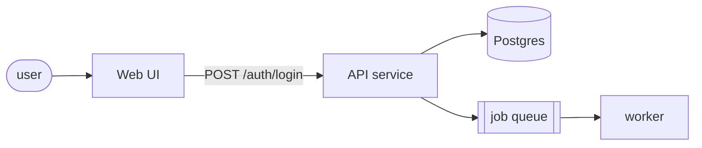

# Architecture

Turn `.sch-loop/PRD.md` into `.sch-loop/ARCHITECTURE.md`: the diagram a planner reads to slice phases, and the decisions a future maintainer will ask about.

## Before writing

- Read `PRD.md` and `BRAINSTORM.md` locked decisions.
- Read the codebase. For a brownfield project, trace one real request end to end before drawing anything — a diagram of what you assume is worse than no diagram.
- If `.codegraph/` exists, use `codegraph explore "<symbols>"` for real call paths instead of grepping.

## Write `.sch-loop/ARCHITECTURE.md`

````markdown
# Architecture: <project>

## System diagram



Show entry points, processing stages, decision points, external dependencies and the direction of data.
A reader must be able to trace the primary use case from input to output by following the arrows.
File listings do not belong in the diagram; they belong in the table below.

## Component responsibilities

| Component | Owns | Does not own | Lives in |
|---|---|---|---|

## Data flow

| Step | From | To | Carries | Failure mode |
|---|---|---|---|---|

## Decisions (ADRs)

### ADR-0001: <title>
**Status:** accepted · **Date:** <date>
**Context:** <2–3 sentences: the forces at play>
**Decision:** <1–2 sentences>
**Alternatives:** <what was rejected and why>
**Consequences:** <what gets easier, what gets harder, what risk is accepted>

## Recommended MCPs (optional — the loop runs without any)

| MCP | Used by | Why it helps here | Cost |
|---|---|---|---|
| Context7 | research tickets | version-accurate library docs | ~500 tokens per tool schema |
| codegraph | verify, architecture | real call paths for wiring checks | already installed |

Keep the total under 10 servers; each tool schema is loaded into every executor.

## Risks

| Risk | Likelihood | Mitigation |
|---|---|---|
````

## Rules

- Write an ADR only for a decision that is hard to reverse, surprising, or carries a real trade-off. Three sentences of context beats a page.
- No MCP is a dependency. State what the loop does when a suggested MCP is absent.
- Do not invent a component the PRD does not require.
- Flag any requirement the architecture cannot satisfy — that is a PRD problem, and it is cheaper to find here.

## Gate

Architecture is a council gate. When `council_mode` is `gated` (the default), convene the council before asking the user to approve:

```sh
node "$CLAUDE_PROJECT_DIR/.claude/sch/runtime/cli.mjs" council .sch-loop/council-request.json
```

Ask one question: *does this architecture deliver every PRD requirement, and what does it make expensive later?* Put the verdict in the file under `## Council verdict`, then present to the user and stop. Approval sets `lifecycle_stage: PLAN`.
